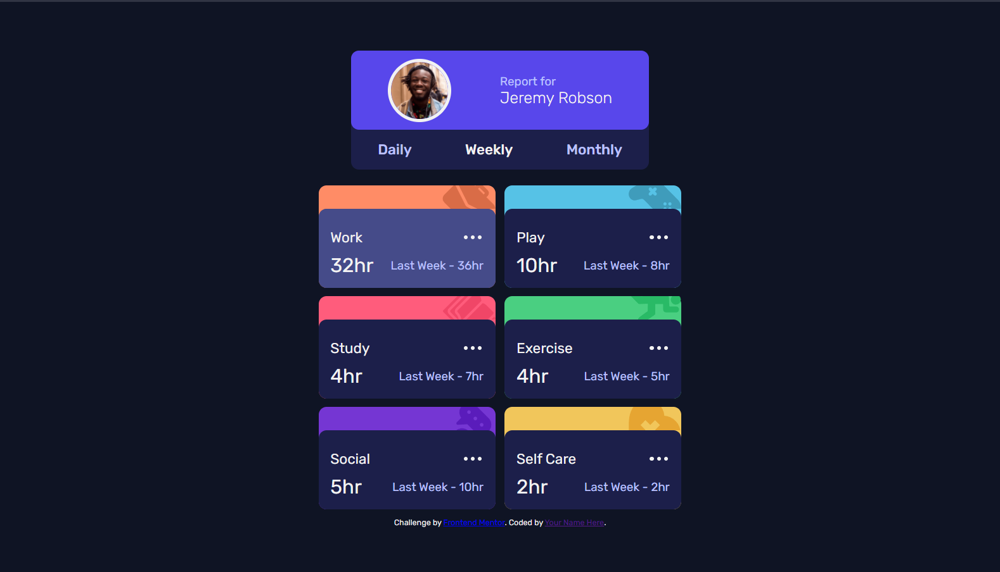

# Frontend Mentor - Time tracking dashboard solution

This is a solution to the [Time tracking dashboard challenge on Frontend Mentor](https://www.frontendmentor.io/challenges/time-tracking-dashboard-UIQ7167Jw). Frontend Mentor challenges help you improve your coding skills by building realistic projects.

## Table of contents

- [Overview](#overview)
  - [The challenge](#the-challenge)
  - [Screenshot](#screenshot)
  - [Links](#links)
- [My process](#my-process)
  - [Built with](#built-with)
  - [What I learned](#what-i-learned)
  - [Continued development](#continued-development)
- [Author](#author)
- [Acknowledgments](#acknowledgments)

## Overview

### The challenge

Users should be able to:

- View the optimal layout for the site depending on their device's screen size
- See hover states for all interactive elements on the page
- Switch between viewing Daily, Weekly, and Monthly stats

### Screenshot

### Links

- Solution URL: [Add solution URL here](https://github.com/XxtbmfxX/front-mentor-01-solution)
- Live Site URL: [Add live site URL here](https://angry-beaver-95e2d5.netlify.app/)

## My process

### Built with

- Mobile-first workflow
- [SASS](https://sass-lang.com/)
- [React](https://reactjs.org/) - JS library

### What I learned

SASS file structure, manage state and pass props in React and mobile-first workflow

### Continued development

I need a better structure in my workflow and more practice with Grid and CSS frameworks.

## Author

- Frontend Mentor - [@XxtbmfxX](https://www.frontendmentor.io/profile/XxtbmfxX)
- Twitter - [@Xx_Toro_xX](https://twitter.com/Xx_Toro_xX)

## Acknowledgments

[Bluuweb](https://www.youtube.com/watch?v=Xe_qNR1mmCg&t=229s)

- This video helped me with netlify and some concepts :D
  [MRZ.Code.Manufacture](https://www.youtube.com/watch?v=AtWjtiayOsI&t=393s)
- This video helped me with the hover effect :D
